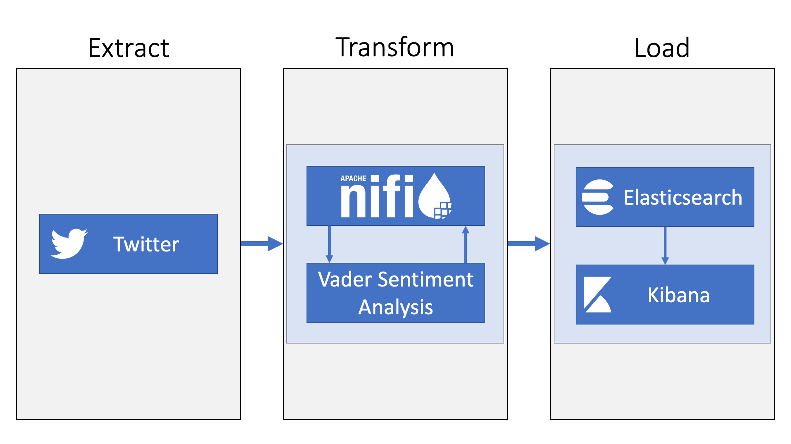
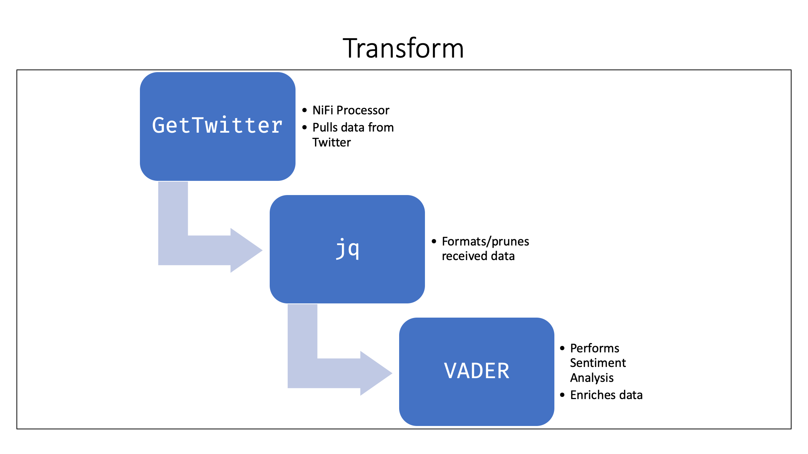
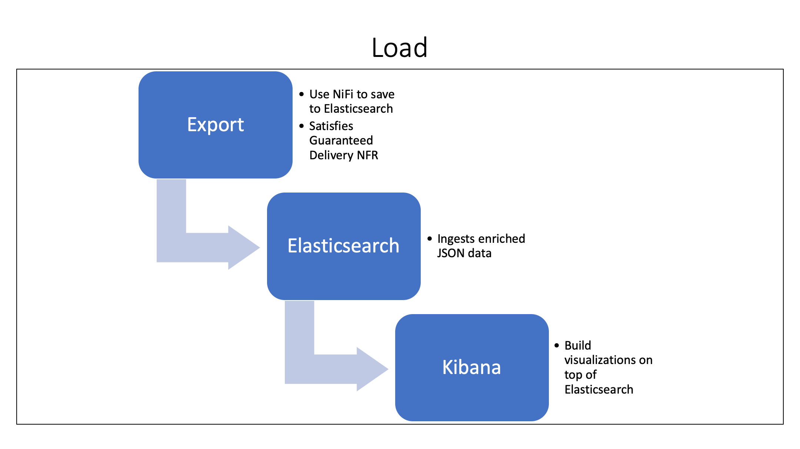

System Overview
===============

> Provide a high-level overview of the system. This is the product
> vision and should be stated in the user's vernacular. (This can be
> modified based on current knowledge).

The Team Big Data (TBD) Analytics Package performs sentiment analysis of
tweets. The sentiment analysis of a user's tweet is a group of numbers
which can be thought of as representing the user's net emotional state
(negative/neutral/positive). This information can be used to more
effectively target a user with advertisements or gain insights to their
desires.

Take your marketing to the next level with the TBD Analytics Package.

Requirements
============

> Compile a comprehensive list of functional (with priorities and
> approximate estimates) and non-functional requirements (with
> measurable criteria).

> Document the changes made to the requirements identified previously.
> Record any changes to priorities, levels of abstraction, etc. Also,
> discuss how those changes could affect your initial estimates. (If
> your requirements have not changed, explicitly mention the same).

**The requirements have not changed from the prior deliverable.**

Functional Requirements
-----------------------

### Fetch data from Twitter 

Twitter is the main source of information that our analytics package
draws from. As such, we need to be able to fetch data from Twitter.

#### Dependencies

No dependencies.

#### Priority

This requirement has an extremely high priority because all the other
priorities depend on it

#### Estimate

The time estimate is about two weeks due to our team's low velocity.
This estimation was derived from prior experience.

### Extract meaningful content from Twitter

The data that Twitter returns is too verbose for the purposes of our
analytics package. Since processing, storing, and analyzing data
requires energy and money, we should aim to do as little of these things
as possible. Therefore, it is necessary to extract only meaningful
information from what Twitter returns.

#### Dependencies

+ Fetch data from Twitter

#### Priority

This requirement has a medium priority as it serves only to help TBD
minimize the utilization of its pipeline and avoid retaining potentially
sensitive information.

#### Estimate

The time estimate is about two weeks due to our team's low velocity.
This estimation was derived from prior experience.

### Enrich content from Twitter with sentiment analysis

Sentiment analysis is the cornerstone of the proposed analytics package.
As such, we must ensure that our pipeline can perform that analysis.

#### Dependencies

+ Fetch data from Twitter

#### Priority

This requirement has an extremely high priority so that we can enable
analytics and visualizations.

#### Estimate 

The time estimate is about two weeks due to our team's low velocity.
This estimation was derived from prior experience.

### Load enriched content into a data store 

Excluding streaming analytics, data must be at rest to be analyzed. As
such, our pipeline must have the ability to load data into a data store.

#### Dependencies

+ Fetch data from Twitter

+ Enrich content from Twitter with sentiment analysis

#### Priority 

This requirement has an extremely high priority as it enables analytics
and visualizations.

#### Estimate 

The time estimate is about one week due to our team's low velocity. This
estimation was derived from prior experience.

### Load data into multiple data stores 

To avoid vendor-lock in and promote the health of the product, our
pipeline should be able to ingest into several different data stores.

#### Dependencies 

No dependencies. Priority This requirement has a medium priority as it
only serves to prevent vendor lock-in.

#### Priority

This requirement has a medium priority as it only serves to prevent
vendor lock-in.

#### Estimate 

The time estimate is about one week due to our team's low velocity. This
estimation was derived from prior experience.

### Provide relevant analytics on the ingested information 

The proposed package should provide meaningful analytics which analyze
not only a user's emotional sentiment at a single instance in time but
also some arbitrary span of time.

#### Dependencies

+ Fetch data from Twitter

+ Enrich content from Twitter with sentiment analysis

#### Priority 

This requirement has an extremely high priority as it provides the
analytics component of the TBD Analytics Package.

#### Estimate 

The time estimate is about two weeks due to our team's low velocity.
This estimation was derived from prior experience

Non-Functional Requirements (NFR) 
----------------------------------

### Scalable system 

A scalable system is one which can run on many different threads on a
single machine. A scalable system is a necessary for non-trivial
big-data packages.

#### Metric 

System has the capability to scale across multiple threads.

### Distributed system 

A distributed system is one which can run on many different machines. A
distributed system is a necessary for non-trivial big-data packages: it
is not usually possible to "scale up" a machine (that is, make it more
powerful), however, it is usually trivial to "scale out" an application
to more machines.

#### Metric 

System has the capability to scale across multiple machines.

### Guaranteed Delivery 

The quality of an analytics package is dependent upon the quality of the
data it analyzes. Guaranteed Delivery ensures that all the data that
enters the pipeline is eventually ingested into a data store, removing
the possibility that data is lost along the way.

#### Metric 

Data Flow Pipeline provides Guaranteed Delivery.

System Architecture
===================

> Discuss the architectural pattern(s) that you plan to apply to your
> system. Justify your decisions. Describe how the non-functional
> requirements are reflected in your architecture. (You can apply
> multiple patterns. Provide the rationale for applying those patterns).

Team Big Data's analytics package uses NiFi to connect Twitter to
Elastic search, transforming data as it passes through it. Such an
architecture is a textbook example of a perfect application for a
flow/pipeline design pattern.

All three of the listed NFR are satisfied by TBD's use of NiFi. NiFi
delivers the capability for a distributed system that can scale out
(multiple machines) as well as scale up (multiple threads).
Additionally, NiFi comes with support for guaranteed delivery out of the
box.

NiFi ensures Non-Functional requirement's Guaranteed delivery from its
Flow File base design that sets pointers to each data and ensure its
delivery by having provenance of repositories. Provenance are record of
repositories' transforms and processes. Furthermore, NiFi's repositories
are set of data that are immutable. In order for repositories to be
transformed or processed, Flow File assigns pointers to the data and
ensure its process by saving original content with its pointer to a
memory which will be used to read and check repositories before it is
streamed to transform or transfer. After it is checked, pointers updates
to guarantee its delivery.

> Provide a visual representation of the complete system architecture.
> You can provide a high level view of the entire system and include
> separate detailed representations for the various components. You can
> also include multiple architectural views.

{ width=90% }

{ width=90% }

{ width=90% }

User Experience
===============

> Discuss the user experience considerations for the system. Does it
> affect any of the architectural decisions? (Example: Let us assume
> that speed of execution is not one of the non-functional requirements
> that your system is striving to achieve. The architecture pattern
> chosen does not reflect this non-functional requirement. However, if
> speed is critical for delivering a rich user experience, you would
> have to review the architecture decisions and potentially modify the
> architecture pattern applied).

There are no additional user experience considerations outside of those
which are impacted by the NFRs. As a result of this lack of additional
considerations and the lack of conflicts between the listed NFRs, it is
unlikely they will change.

Team Retrospective
==================

> Reflect on your team's experiences and document the following:
> (a) What has gone well so far?
> (b) What has not gone well?
> (c) What steps have to be taken in order to address those issues?

Team Big Data's members have been contributing to the project by
attending every scrum, Program Increment Retrospective, and Program
Increment Review. We are pleased to report that collaborative efforts
have been, without fail, positive and productive.

Contributions
=============

> Include information about the following:

-   Who managed the work for this deliverable?

-   Individual Contributions (Briefly describe how the work was
    allocated and list who worked on the different aspects of the
    deliverable).

The System Overview and Requirements sections were taken verbatim from
the first deliverable, which were two sections developed largely by
Connor Baker. Shin Hyoung Oh defined the System Architecture section,
which was then reviewed and finalized by Connor Baker. The System
Architecture Visualization section was also completed by Connor Baker
since he is the team's subject matter expert of the architecture portion
of the project. Ziyan Guo and Ghousia Syed's worked diligently on
enablers to push the project forward.

Meet with GTA
=============

> You have to meet with the GTA and discuss your team's progress with
> respect to the setting up version control and the other tools that
> will be used for implementation and testing, recording meeting
> minutes, and plans for design and implementation. You will also review
> your project's scope and discuss team dynamics.

Nothing set up with version control yet.

How do you test COTS?

Recording meeting minutes within blackboard's wiki.

Started implementation earlier.
