# System Overview

> [5 points] Provide a high-level overview of the system. This is the product vision and should be stated in the user’s vernacular. [This can be modified based on current knowledge]

The Team Big Data (TBD) analytics package performs sentiment analysis of some number of users’ tweets. The sentiment analysis of a user’s tweet is a group of numbers which can be thought of as representing the user’s net emotional state (negative/neutral/positive). This information can be used to more effectively target a user with advertisements or follow their emotional state over time.

# Technology

> [15 points] Describe the technologies that you will be using. Justify your choices. Also discuss the following:
>
> (a) Any assumptions made regarding the existing systems/infrastructure (Examples: any updates/ patches to Firebase will be handled by Google, the user will have an android device, the app will receive permission from the user to use the camera, etc.)
> (b) Changes if any to the requirements and architectural style(s) based on your technology decisions.

As with the use of any COTS product, the foundational assumption is that the product behaves as documented. With respect to COTS, documentation is viewed as promise to the customer that the product is understood to behave in predictable ways. Given the resources that our team has, it is not feasible to perform a formal verification of every tool that we have chosen to use. As such, we assume the documentation of these tools to be correct and free of ambiguity.

The user is assumed to have access to Kibana – this roughly equates to having an internet connection and a modern desktop web browser.

TBD plans to use three main COTS components:

1. NiFi
2. Elasticsearch
3. Kibana

Each of them is detailed below.

## NiFi

Apache NiFi is a dataflow system based on flow-based programming which is used to automate the flow of data between systems. NiFi processors can perform a combination of data routing, transformation or mediation between systems.

NiFi was selected as it is open source software, has a great deal of documentation, and provides an API that can be used to write new processors to add functionality.

## Elasticsearch

Elasticsearch is a distributed, scalable, and high-performance search engine. Elasticsearch offers simple REST based APIs, a simple HTTP interface, and uses schema-free JSON documents. It also provides support for various languages including JAVA, PHP, Node.js etc.

Elasticsearch was selected as a data store as it is open source software, is high-performing and its tight integration with the visualization and analytics tool, Kibana.

## Kibana

Kibana an analytics and visualization tool designed to work with Elasticsearch. Kibana can perform advanced data analysis and visualize the data in a variety of charts, tables, and maps.

Kibana was selected as pairing Kibana and Elasticsearch yields a tightly integrated solution with best-in-class performance, maintainability, and ease of use.

# Changes to Requirements or Architecture

As our requirements and flow/pipeline architectural pattern include the above-mentioned technologies, changes are unnecessary.

# Class Diagrams

> [15 points] Determine a set of classes for the system under consideration. Record those as class diagrams. For each class, provide a class description and explain the various attributes and methods. The class diagrams should include all your “must have” features. Below is a good resource that provides examples of class diagrams: https://www.ibm.com/developerworks/rational/library/content/RationalEdge/sep04/bell/

Due to TBD’s analytics package not employing custom code, there is not a set of class diagrams describing the system. However, we do further describe the implementation details of each component.

Instead, we further describe the Extraction, Transformation, and Loading stages of our pipeline with the below diagrams.

```{=latex}
\newpage
```

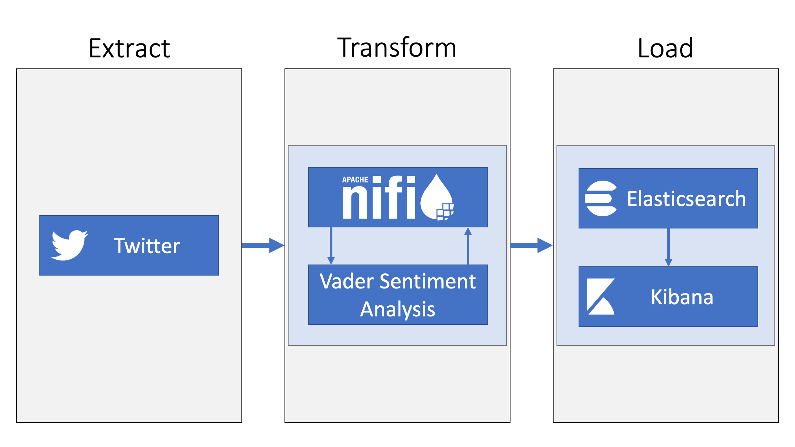{ width=95% }

```{=latex}
\vspace*{\fill}
```

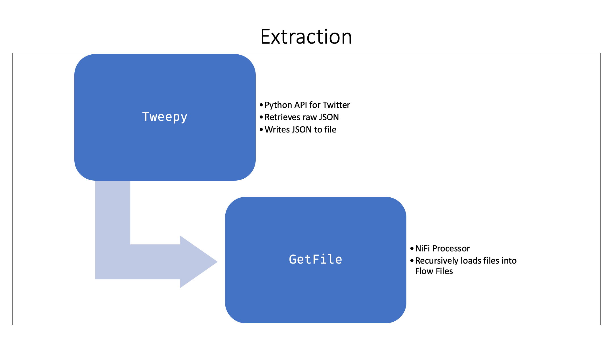{ width=95% }

```{=latex}
\newpage
```

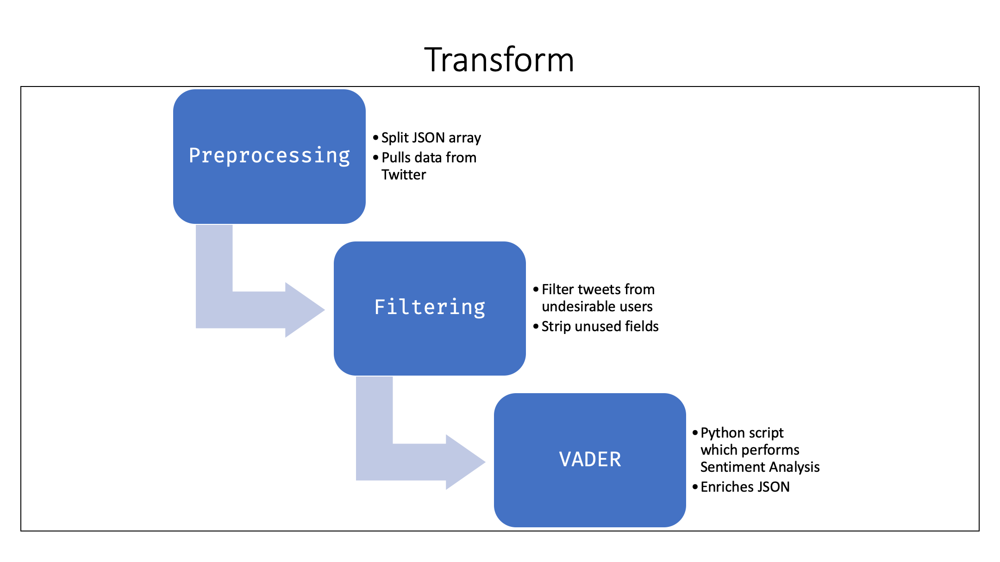{ width=95% }

```{=latex}
\vspace*{\fill}
```

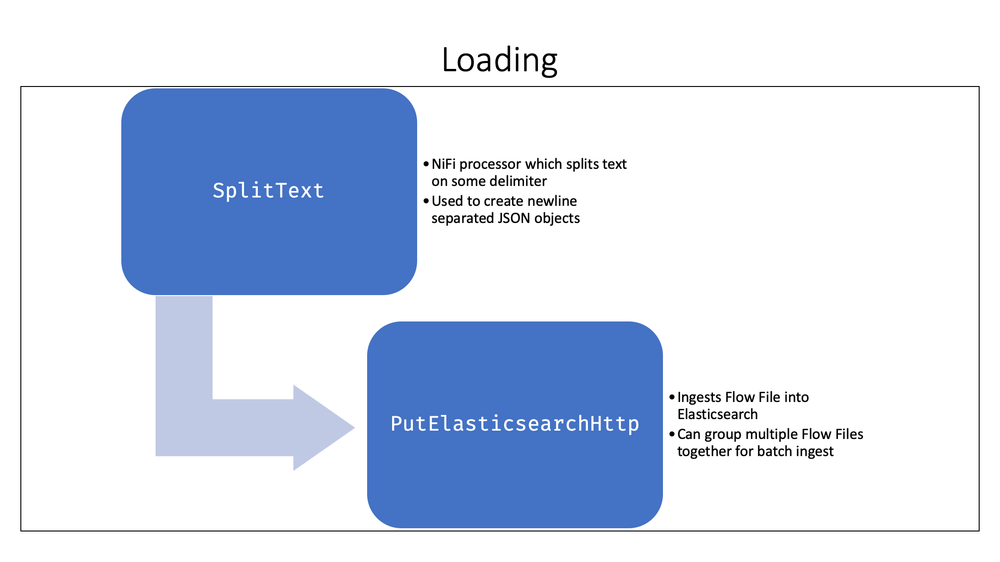{ width=95% }

```{=latex}
\newpage
```

# Dynamic Analysis Diagrams

> [10 points] Based on the use case diagrams created previously, create sequence diagrams for two different use cases. Below is a good resource for sequence diagrams: http://www.ibm.com/developerworks/rational/library/3101.html (through Figure 10).

Dynamic analysis diagrams are highly usually when dealing with COTS software due to the limited observability of the components. Instead, we describe screenshots which trace the flow of control for two use cases.

## A First Use Case

The first use case is for viewing a user’s emotional sentiment over some amount of time.

The user begins by navigating to their Kibana dashboard (this would be a link that the analyst bookmarked).

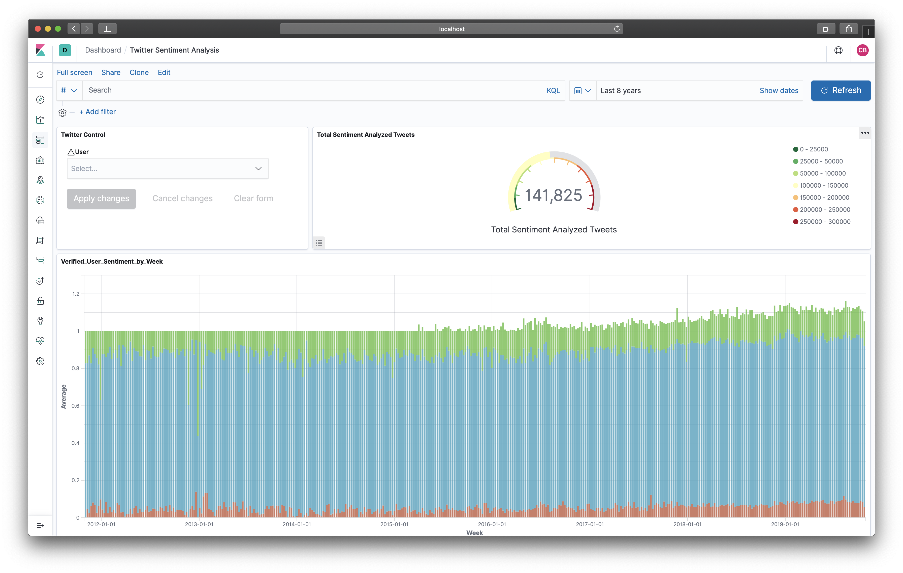{ width=100% }

As the visualization to display a user’s emotional sentiment is visible immediately, the next step is to select a user. This can be done by clicking on the drop-down box in the Twitter Control box and selecting a user, like below, and then selecting apply.

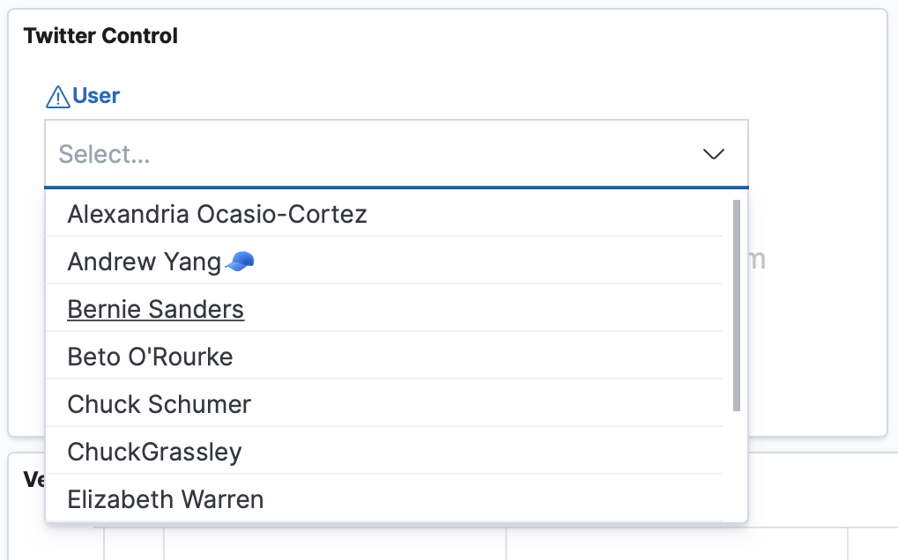{ width=50% }

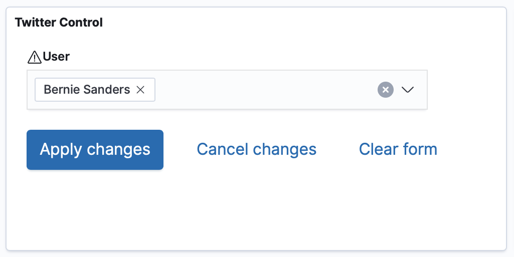{ width=50% }

The view updates immediately upon application of the filter.

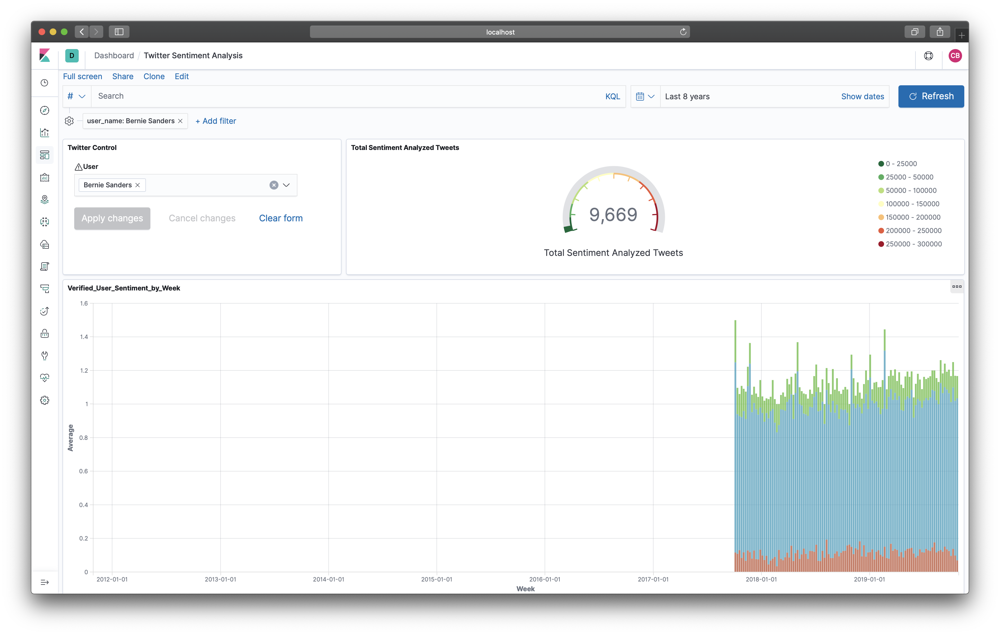{ width=100% }

## A Second Use Case

The second use case is to change the time frame that the data is pulled from. This use case can be thought of as an extension to the previous use case, so we resume from where we left off above. We begin by selecting the calendar icon dropdown from the top right.

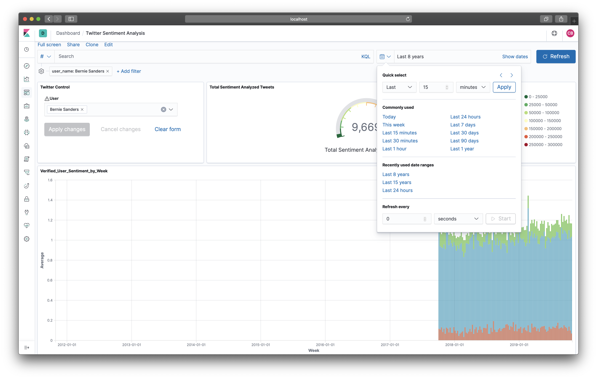{ width=100% }

We then change it so the range is the last 18 months and apply our changes, like below.

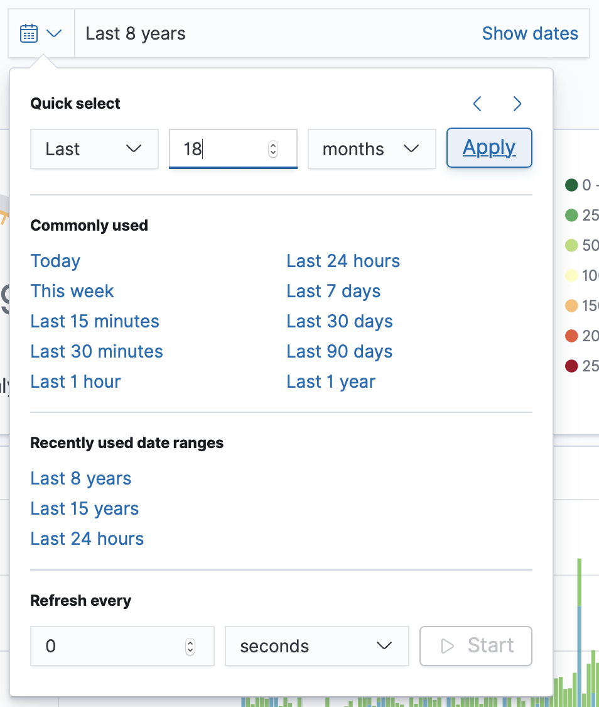{ width=35% }

The view is then updated immediately.

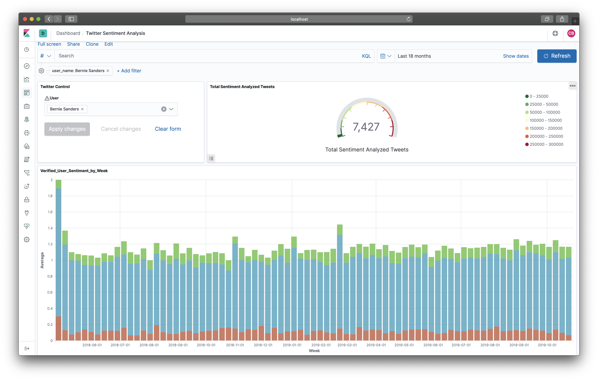{ width=100% }

# User Experience

> [10 points] Discuss the user experience considerations for the system. Does it affect any of the design decisions? Include preliminary screen mockups.

User experience considerations are:

+ Scalable system
+ Distributed system
+ Guaranteed delivery

User experience considerations for the system do not affect any design decisions.

Below we include an early version of our Twitter dashboard.

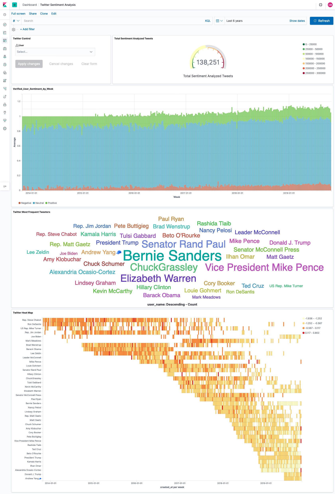{ width=80% }

# Team Retrospective

> [15 points] Reflect on your team’s experiences and document the following:
>
> (a) What has gone well so far?
> (b) What has not gone well?
> (c) What steps have to be taken in order to address those issues?

TBD members have been contributing at every part of the project by attending every scrum, Program Increment Retrospective, and Program Increment Review. There are no current issued faced by the members regarding the project. We are pleased to report that collaborative efforts have been, without fail, positive and productive.

# Contributions

> Include information about the following:
>
> + Who managed the work for this deliverable?
> + Individual Contributions (Briefly describe how the work was allocated and list who worked on the different aspects of the deliverable).

Ghousia Syed managed the work for this deliverable.

The System Overview section was taken verbatim from the first deliverable, which was the section developed largely by Connor Baker. Technology and User experience sections were completed by Ghousia. Class Diagrams and Dynamic analysis diagrams sections were completed by Connor. Ziyan Gao, Shin Hyoung Oh and Ghousia worked on creating visualization on Kibana that helped created the preliminary screen mockups for the user experience section and move the project forward. This deliverable was reviewed and finalized by Connor.
