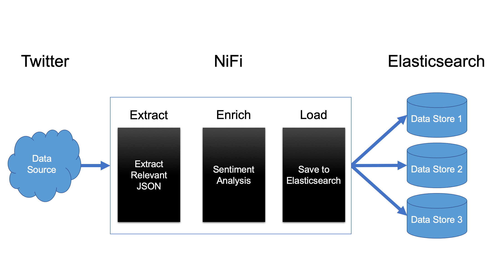

# Business Context

Facebook and Google, the "F" and "G" of FANG, are two of the market's four best-performing tech stocks. Facebook and Google's primary sources of revenue comes from selling ads through their respective platforms. Part of why Facebook and Google have excelled where their competitors have stalled is their ability to acquire information about their users. With every post, click, or search, users of these platforms tell the monolithic companies behind them things about themselves. This information is sold to a third party or used by the company to increase the effectiveness of targeted advertisements.

Information in and of itself has become a market. Numerous companies have sprung up in the information market, each purporting to deliver analytics packages to businesses which would perform miracles like doubling their marketing reach or tripling their click-through rate. These offerings are particularly enticing to businesses without the fortune of controlling a platform which passively aggregates their target market's information.

Team Big Data (TBD) seeks to fill a perceived gap in the market. Most companies lack a platform which passively aggregates information about their target market (à la Google and Facebook). These companies stand to benefit from analytics about the audiences they hope to reach with their advertisements.

It is these businesses that Team Big Data wants to serve.

# Product Vision and Solution

TBD proposes an analytics package which performs sentiment analysis of some number of users' tweets. The sentiment analysis of a user's tweet is a group of numbers which can be thought of as representing the user's net emotional state (negative/neutral/positive). This Information can be used to more effectively target a user with advertisements.

The solution is characterized by the following features:

+ Fetch data from Twitter
+ Extract meaningful content from Twitter
+ Enrich content from Twitter with sentiment analysis
+ Load enriched content into a data store
+ Provide relevant analytics on the ingested information
+ Load data into multiple data stores

# Architecture Vision

{ width=100% }

# Program Risk

