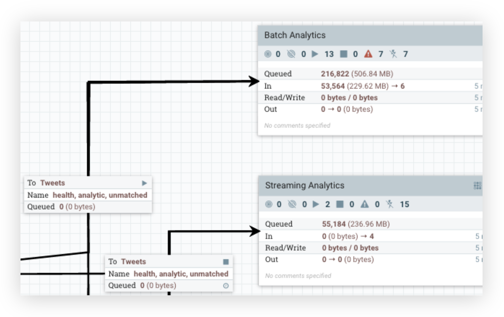
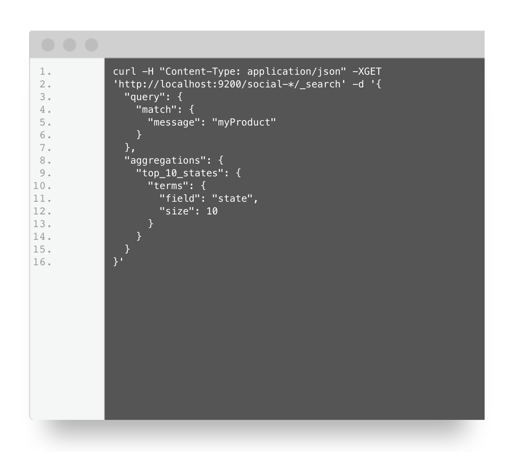
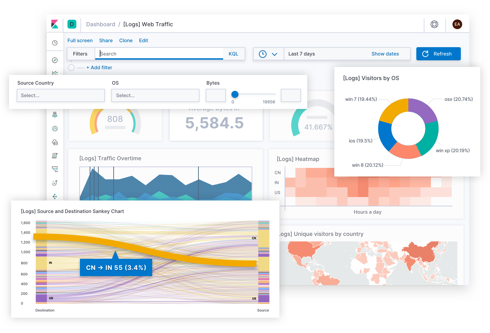

# Background

> You want to create something that people will use... Your product must have unique characteristics that set it apart from any competing products that are already in the market.

*Scientia potentia est*: knowledge is power. It is those which control knowledge, information itself that are truly powerful.

More so than at any point in the history of the world, information has become the market's scarcest resource. This claim seems to be paradoxically at odds with the near-ubiquity of information technology; indeed, never before have so many had the ability to gather so much information. However gathering information and gathering *pertinent* information are two very different things.

A company which produces smartphones does not benefit from knowing the market price of laundry detergent. Likewise, a company which manufactures and sells laundry detergent would not benefit from having information about the specifications of the next generation of smartphones. However, both companies would benefit from knowing information about their competitors and the demographics of their markets. Increasingly, the companies that succeed in the free market are those that have the largest capacity to ingest pertinent information, enrich it, and analyze it to produce yet more information.

Facebook and Google, the "F" and "G" of FANG, are two of the market's four best-performing tech stocks. Facebook and Google's primary sources of revenue comes from selling ads through their respective platforms. Part of why Facebook and Google have excelled where their competitors have stalled is their ability to acquire information about their users. With every post, click, or search users of these platforms tell the monolithic companies behind own them their secrets. This in turn allows them to more effectively advertise toward these users.

Information in and of itself has become a market of sorts. Numerous companies have sprung up in the information market, each purporting to deliver analytics packages to businesses which would perform some miracle like doubling their marketing reach or click-through rate. These offerings are particularly enticing to businesses without the fortune of controlling a platform which passively aggregates their target market's information.

It is these businesses that Team Big Data wants to serve.

# Proposal

## Offering

Team Big Data (TBD) seeks to fill a perceived gap in the market. Most companies lack a platform which passively aggregates information about their target market (à la Google and Facebook). These companies stand to benefit from analytics about the audiences they hope to reach with their advertisements.

TBD's proposed product is an analytics package which performs sentiment analysis of some number of users tweets. The sentiment analysis of a user's tweet can be thought of as representing the user's emotional state (negative/neutral/positive) which can be used to further target advertisements.

TBD's proposed analytics package consists of three parts:

1. A NiFi pipeline which fetches tweets from potential customers and performs sentiment analysis
2. An Elasticsearch backend which ingests data from NiFi
3. A Kibana frontend which provides visualizations, metrics, and analysis

## Proposed Technology Stack

TBD's technology stack consists of three main components:

+ NiFi
+ Elasticsearch
+ Kibana

The following section breaks down the general setup and dependencies of each technology.

### NiFi

{ width=100% }

Apache NiFi is a flow-based programming tool mean to automate the flow of data between systems.

The atom of the NiFi Flow is that of the Processor. A Processor performs some function, be it modifying the content that passes through it or simply redirecting it to a new destination. Processors in turn can be grouped together into Processor Groups. Processor Groups are typically used to isolate different functional portions of the Flow from one another.

We selected NiFi for two main reasons:

1. NiFi is open source (which makes security audits easy) and has a great deal of documentation, and
2. NiFi provides an API one can use to write new processors (in Java) to add functionality.

The NiFi portion of the stack takes care of three main tasks:

#### Fetching data from the edge

NiFi comes with a Processor which, when configured, is able to fetch data from Twitter as a JSON object.

#### Transforming and enriching data

The JSON object Twitter yields contains a great deal of data that is irrelevant to our needs. To avoid bloat in our data store due to maintaining information which is unneeded, we extract the relevant fields. This extraction is performed by `jq`, a tool like `sed` built for JSON (<https://stedolan.github.io/jq/>).

The body of the tweet is then transformed into a JSON object containing the results of the text's sentiment analysis. The sentiment analysis is performed by Vader Sentiment, a tool written in python (<https://github.com/cjhutto/vaderSentiment>).

#### Ingesting data into a data store

Elasticsearch is a first-class citizen in NiFi. As such, as there exists a Processor meant to allow ingestion into an Elasticsearch index.

### Elasticsearch

{ width=100% }

Elasticsearch is a fast, resilient, and distributed search and analytics engine. Elasticsearch uses a RESTful API and JSON, but also has clients for a number of different languages.

Elasticsearch was selected as the data store due to its performance and tight integration with its companion application, Kibana, which provides insight on the data stored with Elasticsearch.

### Kibana

{ width=100% }

Kibana is made by the same company behind Elasticsearch and is billed as the "window" into Elasticsearch. Kibana comes with dozens of visualization templates, each of which can be expanded and built on.

Since Kibana is built by the same company that makes Elasticsearch, pairing the two of them yields best-in-class performance, maintainability, and ease of use.

## Development Methodology

To enable high-velocity development, TBD embraces the Scaled Agile Framework (SAFe).

### Delivery Cadence

The semester is 16 weeks long. For this reason, TBD proposes that each sprint lasts two weeks. Every two sprints is followed by a Planning Increment, during which TBD will meet with the customer (the Professors and TAs) to better synchronize with their needs.

### Collaborative Tools

TBD will use the following tools to enable collaboration and SAFe.

#### Slack

#### Trello

#### Github