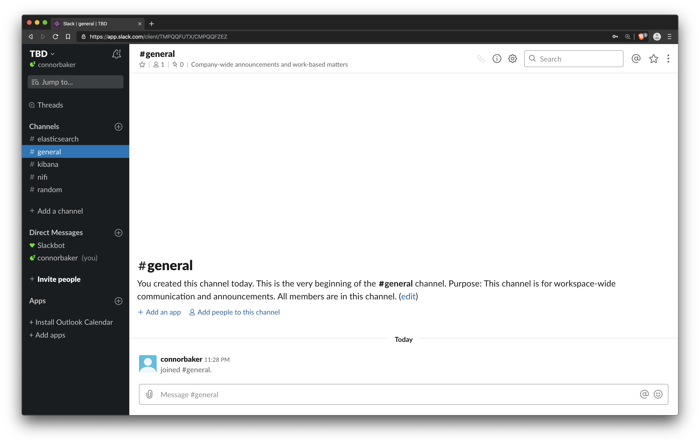
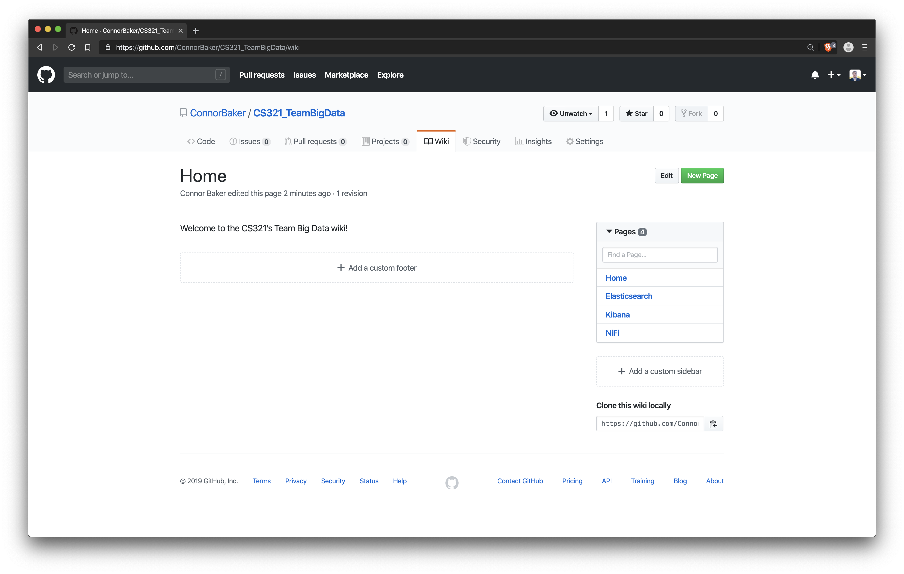

# Background

> You want to create something that people will use... Your product must have unique characteristics that set it apart from any competing products that are already in the market.

*Scientia potentia est*: knowledge is power.

More so than at any point in the history of the world, information has become the market's scarcest resource. This claim seems paradoxically at odds with the near-ubiquity of information technology; indeed, never before have so many had the ability to gather so much information. However gathering information and gathering *pertinent* information are two very different tasks. Increasingly, the companies that succeed in the free market are those that have the largest capacity to ingest pertinent information, enrich it, and analyze it to produce actionable information.

Facebook and Google, the "F" and "G" of FANG, are two of the market's four best-performing tech stocks. Facebook and Google's primary sources of revenue comes from selling ads through their respective platforms. Part of why Facebook and Google have excelled where their competitors have stalled is their ability to acquire information about their users. With every post, click, or search, users of these platforms tell the monolithic companies behind them things about themselves. This information is sold to a third party or used by the company to increase the effectiveness of targeted advertisements.

Information in and of itself has become a market. Numerous companies have sprung up in the information market, each purporting to deliver analytics packages to businesses which would perform miracles like doubling their marketing reach or tripling their click-through rate. These offerings are particularly enticing to businesses without the fortune of controlling a platform which passively aggregates their target market's information.

It is these businesses that Team Big Data wants to serve.

```{=latex}
\newpage
```

# Proposal

## Offering

Team Big Data (TBD) seeks to fill a perceived gap in the market. Most companies lack a platform which passively aggregates information about their target market (à la Google and Facebook). These companies stand to benefit from analytics about the audiences they hope to reach with their advertisements.

TBD proposes an analytics package which performs sentiment analysis of some number of users tweets. The sentiment analysis of a user's tweet is a group of numbers which can be thought of as representing the user's emotional state (negative/neutral/positive). Information about the user's emotional state can be used to more effectively target them with advertisements.

TBD's proposed analytics package consists of three parts:

1. A NiFi pipeline which fetches tweets from potential customers and performs sentiment analysis
2. An Elasticsearch backend which ingests data from NiFi
3. A Kibana frontend which provides visualizations, metrics, and analysis

## Proposed Technology Stack

TBD's technology stack consists of three main components:

+ NiFi
+ Elasticsearch
+ Kibana

The following section breaks the use of each technology.

```{=latex}
\newpage
```

### NiFi

{ width=100% }

Apache NiFi is a flow-based programming tool meant to automate the flow of data between systems.

The atom of the NiFi Flow is that of the Processor. A Processor performs some function, be it modifying the content that passes through it or simply redirecting it to a new destination. Processors in turn can be grouped together into Processor Groups. Processor Groups are typically used to isolate functionally different portions of the Flow from one another.

TBD selected NiFi for two main reasons:

1. NiFi is open source (which makes security audits easy) and has a great deal of documentation, and
2. NiFi provides an API one can use to write new processors (in Java) to add functionality.

The NiFi portion of TBD's technology stack takes care of three main tasks:

1. Fetching data from the edge
2. Transforming and enriching data
3. Ingesting data into a data store

#### Fetching data from the edge

NiFi comes with a Processor which, when configured, is able to fetch data from Twitter as a JSON object.

#### Transforming and enriching data

The JSON object Twitter yields contains a great deal of data that is irrelevant to our needs. To avoid bloat in our data store due to maintaining information which is unneeded, we extract the relevant fields. This extraction is performed by `jq`, a `se` like tool built for JSON (<https://stedolan.github.io/jq/>).

The body of the tweet is then transformed into a JSON object containing the results of the text's sentiment analysis. The sentiment analysis is performed by Vader Sentiment, a open source tool written in python (<https://github.com/cjhutto/vaderSentiment>).

#### Ingesting data into a data store

NiFi ships with a Processor which provides the capability to ingest into Elasticsearch.

```{=latex}
\newpage
```

### Elasticsearch

{ width=100% }

Elasticsearch is a fast, resilient, and distributed search and analytics engine. Elasticsearch offers a RESTful API and both ingests and exports JSON so it can be used with nothing more than `curl`. However, Elasticsearch also provides clients for a number of languages.

Elasticsearch was selected as the data store due to its incredible performance and tight integration with the open source visualization and analytics tool, Kibana.

```{=latex}
\newpage
```

### Kibana

{ width=100% }

Kibana is made by the same company behind Elasticsearch and is billed as the "window" into Elasticsearch. Kibana comes with dozens of visualizations, each of which can be expanded and built on. Pairing Kibana and Elasticsearch yields a tightly integrated solution with best-in-class performance, maintainability, and ease of use.

```{=latex}
\newpage
```

## Development Methodology

To enable high-velocity development, TBD embraces several techniques from Extreme Programming (XP) and the Scaled Agile Framework (SAFe).

While the teachings and practices of SAFe are highly regarded by enterprise, even the smallest configuration, Essential SAFe, requires a team about three times the size of TBD's. As such, rigorously following SAFe is impractical. However, by taking several techniques from XP and most of the customer-facing ceremonies from SAFe, TBD is able to reap the benefits of both.

### Delivery Cadence

The semester is 16 weeks long. For this reason, TBD proposes that each sprint lasts two weeks, and an Iteration consist of two sprints. Furthermore, every second Iteration is to be followed by a Planning Increment.

To ensure alignment with the needs of the customer, the semester would begin with a Planning Increment.

#### Sprint

A sprint consists of 10 days of scrum and two internal demos.

#### Iteration Review

Each sprint is followed by an Iteration Review. An Iteration Review is a team meet up in which each member gauges the progress made during the increment and performs backlog grooming to prepare for the next iteration.

#### Iteration Retrospective

Each Iteration Review is followed by an Iteration Retrospective. An Iteration Retrospective is a team meet during which members discuss the practices that they followed (or did not follow) and identify ways to improve. It is also an opportunity to discover consistent or uniform impediments. The goal of the Iteration Retrospective is to discover what within the team is working well, what is not, and actionable items that can be taken towards improvement.

#### Planning Increment

The purpose of the Planning Increment is to allow TBD to meet with the customer (the Professor and TAs) to better synchronize with their needs. The Planning Increment will begin with a demonstration of the minimum viable product (MVP) created over the previous two iterations. Following this, the team will share the user stories that they were able to finish, and briefly describe why they were unable to finish others. Afterwards, TBD works with the customer to define their vision and create a road map. From these, features and user stories are generated and put into TBD's backlog.

### Collaborative Tools

TBD will use the following tools to enable collaboration.

```{=latex}
\newpage
```

#### Slack

Slack will serve as the development team's primary means of communication. Instant messaging and the ability to easily share screenshots helps with the rate at which problems can be identified, diagnosed, and solved with distributed teams.

{ width=100% }

```{=latex}
\newpage
```

#### Trello

Trello will be the team's agile workflow. There will be one board per sprint, each serving as our backlog and Kanban board.

{ width=100% }

```{=latex}
\newpage
```

#### GitHub

GitHub will serve as our revision control system (RCS). In addition to being an RCS, it will also serve as our document repository, thanks to its Wiki functionality.

{ width=100% }
